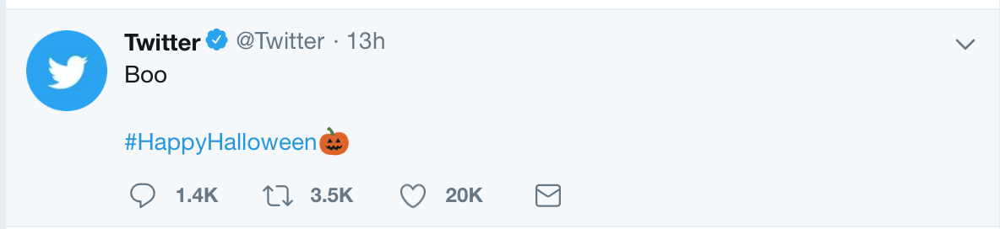
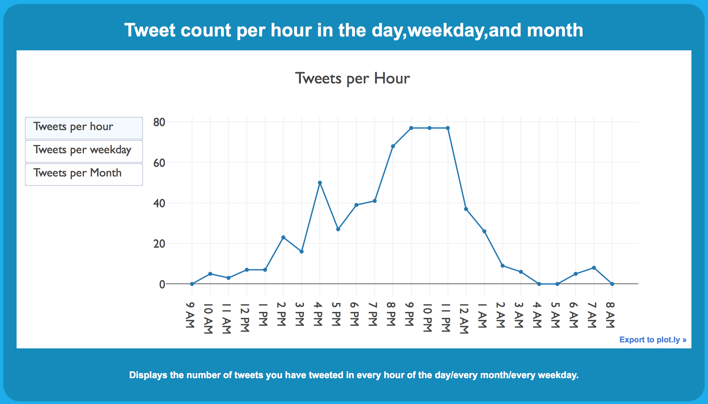

# Analyzeyourtweets
A website where you can type your twitter handle and have your tweets analyzed.

## What Exactly Does the application Do?

  The general purpose of this web-app is to return interesting data/statistics about your tweets in three
broad categories: Sentiment data, general data, and Interactions data.

### Sentiment Data

  Sentiment data refer to any data that can be tied to the "sentiment" of a tweet. The sentiment of a 
tweet is roughly how positive or negative it is. For example: "I hate bananas. They are very bad!" would
have a pretty negative sentiment score. There's plenty of interesting data that can linked to the sentiment of tweets,
such as the frequency of certain words below a certain sentiment threshold(the wordcloud displayed on this site), or 
how any interactions you get with a tweet based on sentiment(do emotionally charged tweets, either negative or positive get more interactions?),
or even the time you tweeted and whether that has any correlation with how negative or positive your tweet was (the graph that plots sentiment per weekday).
                
### General Data

  General data is basically any data/statistics that doesn't have to do with tweet sentiment or
interactions with a tweet. Examples of what is displayed in the site include a graph that plots
tweets per hour which models your tweeting behaviour throughout the day and shows the hours you tweet the most
or least, tweets per month, tweets per hour based on month, and more. 
                
### Interactions Data

  Interactions Data is data that deals with quotes,retweets,mentions,favorites, and replies. Interactions go both ways,
you can interact with others, and others can interact with you. Unfortunately, twitter makes it 
hard/impossible (unless you pay) to get information about tweets you favorite and the interactions
with your tweets other than the retweet/favorite count of a tweet. As such, this website returns statistics
based on the retweet/favorite count of your tweets and the people you interact with (reply,quote,mention,and retweet). Examples of such data include but are definitely not limited to: the top 5 people you interact with and the amount of favorites/retweets you get based on time in the hour posted - this shows you what time to post your tweets if you want the best chance of getting the most interactions.

## How does it do it?
There are 5 main steps to get from the tweets you see on screen 

to a graph like this

The 5 steps are:
- getting the tweets
- cleaning the tweets
- modeling the tweets
- creating axes of the graph
- Output!

### getting the tweets

~~~~
def gettweets(name,num,timezone):
        tweets = tweepy.Cursor(api.user_timeline,screen_name = name,tweet_mode = 'extended').items(num)
        tweetlist =[]
        
        for tweet in tweets:
                mytweet = tweetzz(timezone,tweet,name)
                tweetlist.append(mytweet)
        
        return tweetlist
~~~~
There are parts of this code that will be explained later. This is the way I get tweets. The first line after the method declaration is a method call from the tweepy library (discussed below) that makes http requests to the twitter api and gets data back in json form. It then parses that data and puts it in a object that models a tweet. api.user_timeline() returns an iterable which has a bunch of those "tweet" objects which I then extract and use to create my own model of a tweet object which is of class tweetzz. Those new tweet objects (mine) are then added to a list for later reference. 

### cleaning a tweet
~~~~
def cleansentence(tweet):
    dirtytweet = tweet.split(' ')
    return ' '.join([word for word in dirtytweet if not word.startswith('@') and not word.startswith('RT') and not word.startswith('http')])
~~~~

This methods cleans a tweet by building a string without any of the "dirty" elements on the tweet that muddle it's meaning 
when analyzing sentiment/outputing the text. When a user retweets a tweet, the text that tweepy returns has something along the lines of RT @handle blah blah blah. When it comes to analyzing the sentiment of the tweet you want the tweet to have less/none of these symbols which have either no meaning or a unintuitive/inapplicable meaning to the sentiment analyzer which can make the score it returns incorrect. This also applies when a user links something or mentions someone, etc. 
